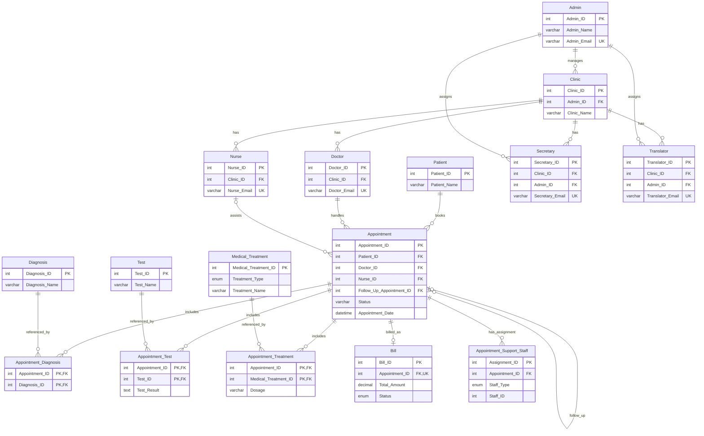

# Hospital Management System - ER Diagram (Mermaid)

Sunumda kullanmak icin bu kodu Markdown destekleyen bir editore yapistirarak diyagrami dogrudan goruntuleyebilirsin.

## Notes

- `Appointment_Support_Staff` tablosu polimorfik bir baglanti kullanir (`Staff_Type` + `Staff_ID`), yani `Staff_ID` dogrudan `Secretary` veya `Translator` tablosuna FK ile bagli degildir.
- `Appointment -> Bill` iliskisi pratikte `Appointment_ID` uzerindeki unique kisiti nedeniyle 1:0..1 seklindedir.
- `Appointment` tablosunda self-reference (`Follow_Up_Appointment_ID`) ile takip randevusu zinciri modellenir.
- Recete kavrami uygulamada `Appointment_Treatment + Medical_Treatment(Treatment_Type='Medication')` uzerinden turetilir; ayri bir `Prescription` tablosu yoktur.
