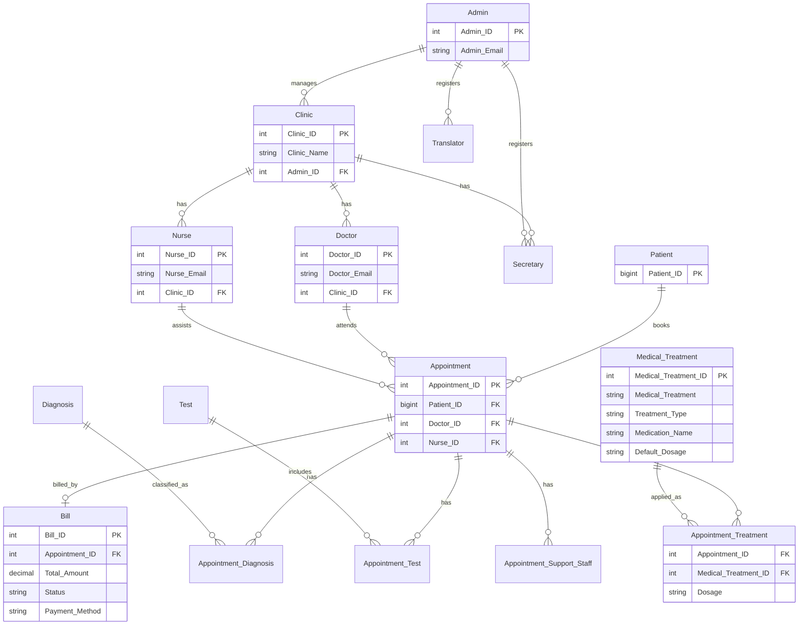

# Hospital Management ER Diagram

```mermaid
erDiagram
    Admin ||--o{ Clinic : manages
    Clinic ||--o{ Doctor : has
    Clinic ||--o{ Nurse : has
    Clinic ||--o{ Secretary : has
    Admin ||--o{ Secretary : registers
    Admin ||--o{ Translator : registers

    Patient ||--o{ Appointment : books
    Doctor ||--o{ Appointment : attends
    Nurse ||--o{ Appointment : assists
    Appointment ||--o| Bill : billed_by

    Appointment ||--o{ Appointment_Diagnosis : has
    Diagnosis ||--o{ Appointment_Diagnosis : classified_as

    Appointment ||--o{ Appointment_Test : has
    Test ||--o{ Appointment_Test : includes

    Appointment ||--o{ Appointment_Treatment : has
    Medical_Treatment ||--o{ Appointment_Treatment : applied_as

    Appointment ||--o{ Appointment_Support_Staff : has

    Admin {
      int Admin_ID PK
      string Admin_Email
    }
    Clinic {
      int Clinic_ID PK
      string Clinic_Name
      int Admin_ID FK
    }
    Doctor {
      int Doctor_ID PK
      string Doctor_Email
      int Clinic_ID FK
    }
    Nurse {
      int Nurse_ID PK
      string Nurse_Email
      int Clinic_ID FK
    }
    Patient {
      bigint Patient_ID PK
    }
    Appointment {
      int Appointment_ID PK
      bigint Patient_ID FK
      int Doctor_ID FK
      int Nurse_ID FK
    }
    Bill {
      int Bill_ID PK
      int Appointment_ID FK
      decimal Total_Amount
      string Status
      string Payment_Method
    }
    Medical_Treatment {
      int Medical_Treatment_ID PK
      string Medical_Treatment
      string Treatment_Type
      string Medication_Name
      string Default_Dosage
    }
    Appointment_Treatment {
      int Appointment_ID FK
      int Medical_Treatment_ID FK
      string Dosage
    }
```
